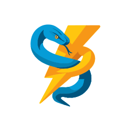

---
hide:
  - navigation
  - toc
---

<style>
.md-typeset h1 {
    display: none;
}
</style>

<div align="center" markdown>



# **PyOZ**

### Python extensions in Zig, made easy

[](https://github.com/dzonerzy/PyOZ)
[](https://www.python.org/)
[](https://ziglang.org/)
[](https://github.com/dzonerzy/PyOZ/blob/main/LICENSE)

---

**Zig's power meets Python's simplicity.**  
Build blazing-fast extensions with zero boilerplate and zero Python C API headaches.

[Get Started](quickstart.md){ .md-button .md-button--primary }
[View on GitHub](https://github.com/dzonerzy/PyOZ){ .md-button }

</div>

---

<div class="grid cards" markdown>

-   :material-lightning-bolt:{ .lg .middle .icon-orange } **High Performance**

    ---

    Native Zig code compiles to optimized machine code. No GC overhead, predictable performance.

-   :material-shield-check:{ .lg .middle .icon-green } **Type Safe**

    ---

    Zig's compile-time checks catch bugs before runtime. PyOZ adds Python type safety on top.

-   :material-puzzle:{ .lg .middle .icon-purple } **Simple API**

    ---

    Declarative module definitions. Just write Zig functions - PyOZ handles the bindings.

-   :fontawesome-brands-python:{ .lg .middle .icon-blue } **Full Python Support**

    ---

    Classes, magic methods, properties, NumPy arrays, enums, exceptions, and more.

</div>

---

## Quick Example

```zig
const pyoz = @import("PyOZ");

fn add(a: i64, b: i64) i64 {
    return a + b;
}

const MyModule = pyoz.module(.{
    .name = "mymodule",
    .funcs = &.{
        pyoz.func("add", add, "Add two numbers"),
    },
});

pub export fn PyInit_mymodule() ?*pyoz.PyObject {
    return MyModule.init();
}
```

```python
import mymodule
print(mymodule.add(2, 3))  # 5
```

---

## Comparison

<div class="comparison-table" markdown>

| | :material-lightning-bolt:{ .pyoz-icon } **PyOZ** | :fontawesome-brands-rust:{ .rust-icon } **PyO3** | :fontawesome-brands-python:{ .python-icon } **Cython** |
|:--|:--:|:--:|:--:|
| **Language** | Zig | Rust | Python/C |
| **API Style** | :material-check-all:{ .green } Declarative | :material-check:{ .lime } Macro-based | :material-check:{ .orange } Mixed syntax |
| **Build Setup** | :material-check-all:{ .green } Simple | :material-check:{ .orange } Maturin/setuptools | :material-check:{ .orange } setuptools |
| **C Library Interop** | :material-check-all:{ .green } Seamless | :material-check:{ .orange } Via unsafe/bindgen | :material-check-all:{ .green } Native |
| **Compile Time** | :material-check-all:{ .green } Fast | :material-check:{ .orange } Slow | :material-check:{ .lime } Medium |
| **Cross-Compile** | :material-check-all:{ .green } Built-in | :material-check:{ .orange } Via cross/cargo | :material-check:{ .orange } Complex |
| **NumPy Support** | :material-check-all:{ .green } Zero-copy | :material-check:{ .lime } Via crate | :material-check-all:{ .green } Native |
| **Async Support** | :material-close:{ .red } No | :material-check-all:{ .green } Yes | :material-check:{ .orange } Limited |
| **Ecosystem** | :material-check:{ .orange } Growing | :material-check-all:{ .green } Mature | :material-check-all:{ .green } Mature |

</div>

---

<div align="center" markdown>

[Installation](installation.md){ .md-button } 
[Quick Start](quickstart.md){ .md-button }
[Guide](guide/functions.md){ .md-button }

</div>
